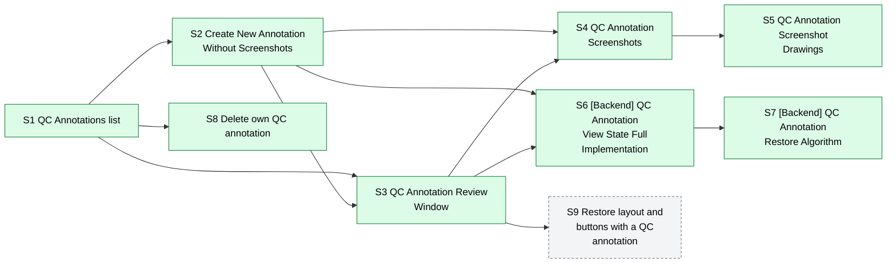
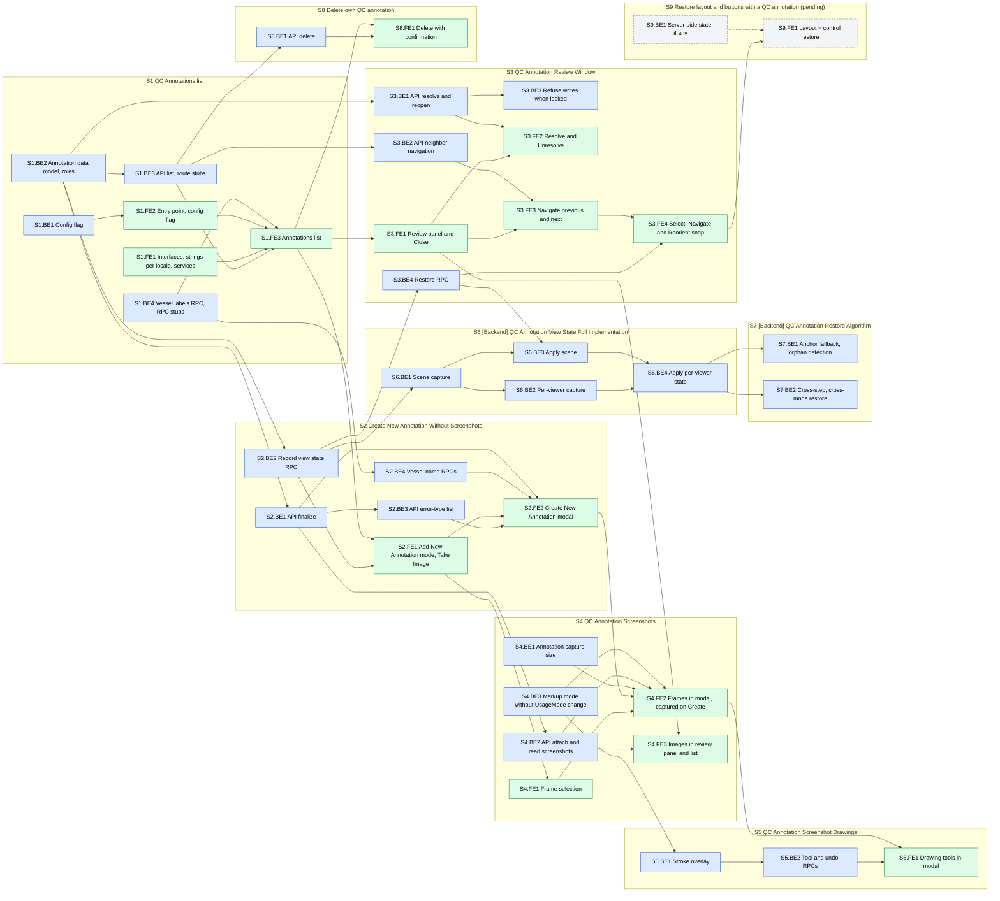

## Dependency graph

### Stories dependencies

Gray dashed ones are pending a product decision.

### Sub-tasks dependencies

Blue sub-tasks belong to BE, green to FE, and grey dashed ones are pending. An arrow means "must be merged before the target can be integrated and tested". FE can start any sub-task earlier against the agreed RPC/API contract with mocks, so the arrow is about integration, not about starting. Left to right is dependency depth, not calendar order; the suggested order below shows the sequence each developer works in.

### Suggested order

Each developer works down their queue in order. The items in parentheses must merge first before the FE item can be integrated; FE can build ahead against mocks. S9 is pending, so it's left out.

| #  | BE                                          | FE                                                                  |
| -- | ------------------------------------------- | ------------------------------------------------------------------- |
| 1  | S1.BE1 Config flag                          | S1.FE1 Interfaces, strings per locale, services                     |
| 2  | S1.BE2 Annotation data model, roles         | S1.FE2 Entry point, config flag (S1.BE1)                            |
| 3  | S1.BE3 API list, route stubs                | S1.FE3 Annotations list (S1.BE3, S1.BE4)                            |
| 4  | S1.BE4 Vessel labels RPC, RPC stubs         | S2.FE1 Add New Annotation mode, Take Image (S2.BE2)                 |
| 5  | S2.BE1 API finalize                         | S2.FE2 Create New Annotation modal (S2.BE1, S2.BE3, S2.BE4)         |
| 6  | S2.BE2 Record view state RPC                | S3.FE1 Review panel and Close                                       |
| 7  | S2.BE3 API error-type list                  | S3.FE2 Resolve and Unresolve (S3.BE1)                               |
| 8  | S2.BE4 Vessel name RPCs                     | S3.FE3 Navigate previous and next (S3.BE2)                          |
| 9  | S3.BE1 API resolve and reopen               | S3.FE4 Select, Navigate and Reorient snap (S3.BE4)                  |
| 10 | S3.BE2 API neighbor navigation              | S4.FE1 Frame selection                                              |
| 11 | S3.BE3 Refuse writes when locked            | S4.FE2 Frames in modal, captured on Create (S4.BE1, S4.BE2, S4.BE3) |
| 12 | S3.BE4 Restore RPC                          | S4.FE3 Images in review panel and list                              |
| 13 | S4.BE1 Annotation capture size              | S5.FE1 Drawing tools in modal (S5.BE2)                              |
| 14 | S4.BE2 API attach and read screenshots      | S8.FE1 Delete with confirmation (S8.BE1)                            |
| 15 | S4.BE3 Markup mode without UsageMode change |                                                                     |
| 16 | S5.BE1 Stroke overlay                       |                                                                     |
| 17 | S5.BE2 Tool and undo RPCs                   |                                                                     |
| 18 | S8.BE1 API delete                           |                                                                     |
| 19 | S6.BE1 Scene capture                        |                                                                     |
| 20 | S6.BE2 Per-viewer capture                   |                                                                     |
| 21 | S6.BE3 Apply scene                          |                                                                     |
| 22 | S6.BE4 Apply per-viewer state               |                                                                     |
| 23 | S7.BE1 Anchor fallback, orphan detection    |                                                                     |
| 24 | S7.BE2 Cross-step, cross-mode restore       |                                                                     |

S6 and S7 have no FE sub-tasks, so FE's queue ends at S8.FE1 while BE continues; that gap is the natural home for S9 if it stays in scope.
## Stories
### S1

- **Title:** QC Annotations list
- **Components:** Analyst Workflow, QC Workflow
- **Linked to:** SRS-1391

**Description**
This story provides the user-facing Annotations list and foundations for the QC Annotations feature.

This story introduces the temporary config flag for QC Annotations, which is accessed by the client and server as follows:
- Client: Calls the RPC `annotations.enabled` which fetches a bare boolean, `true` if QC Annotations feature is enabled, `false` if not. 
- Server: An environment variable `QC_ANNOTATIONS_ENABLED=true` which Django reads at startup, and ProServer inherits.

This story lays the groundwork everything else builds on:
- Frontend:
	- Interfaces and services for API endpoints and RPCs
	- Button to open the Annotations list, usable throughout entire case building workflow. It appears based on `annotations.enabled` RPC call
	- Annotations list page which fetches list of annotations via API GET endpoints
		- Columns: created date/time, creator name, status, resolution date, resolver, and Vessel Name; S4 adds the image icon
		- Newest first, sortable by created date, 10 rows per page, and empty cells shown as "N/A"
		- Close works; Add New Annotation is shown but disabled until S2
	- Ukrainian translations of the new strings are specified by someone else; working out how to get them into the `ua` locale files is in scope
- Backend:
	- `Annotation` data model & DB
	- API GET route for the list, `GET /api/annotations/?workitem=<id>`, with `page`, `page_size` and `ordering` by created date in either direction
	- `annotations.enabled` RPC call
	- `annotations.vessel.names` RPC, unfiltered (every reportable vessel), for the list's Vessel Name labels
	- Stubs for remaining API routes & RPC: stub routes return 501 Not Implemented, stub RPCs with the `{success, error: {reason}}` envelope return reason `NOT_IMPLEMENTED`, and bare-value stub RPCs return `false` or an empty string
	- Access rules (Analyst and Manager roles)
	- `captured` annotations are invisible to every reader

**Out of scope.** Creating and reviewing annotations.

**References.** 
- A reference `design.md`, including API & RPC definitions and sequence diagrams, can be found here: https://github.com/ElucidBioimaging/EVServer/blob/ZEN-11307-qc-annotation-save-state-prototype/arch/draft/qc_annotations/design.md
	- Relevant to this story is the Retrieval and Restore Flow sequence diagram's 1st user interaction (Click the Annotations toolbar button).
- Rough Claude-generated prototype
	- Branches:
		- https://github.com/ElucidBioimaging/EVClient/tree/ZEN-11307-qc-annotation-save-state-prototype
		- https://github.com/ElucidBioimaging/EVServer/tree/ZEN-11307-qc-annotation-save-state-prototype
	- Potentially relevant: `app/annotations/`, `Annotation` in `app/CAPgraph/models.py`, `qc-annotations-dialog`, `image-actions-toolbar-side`, `GetQcAnnotationVesselNames` in `vtkEvWebApplication.cxx`.

**Acceptance Criteria**
- No regressions when the config flag is off.
- When the config flag is on, the button to launch the Annotations list modal appears and opens the modal on every step of the case building process. The button does not appear elsewhere in the application (such as Review mode). 
	- Close works; Add New Annotation is shown but disabled.
	- Since no annotations can be created yet, the Annotations list modal's table is expected to be empty.

**Sub-tasks**

| ID     | Est. LOC        | Title                                    | Done when                                                                                                                                                                                                                                                                                           | Needs                          |
| ------ | --------------- | ---------------------------------------- | --------------------------------------------------------------------------------------------------------------------------------------------------------------------------------------------------------------------------------------------------------------------------------------------------- | ------------------------------ |
| S1.BE1 | 40 + 30 tests   | Config flag                              | `QC_ANNOTATIONS_ENABLED` defaults to `false` in `etc/evserver/base.properties`, is listed in `etc/base.env` and passed through `docker-compose.yml` (and `docker/compose/local-proserver.yml`), is read in Django settings, and `annotations.enabled` reports its value.                            |                                |
| S1.BE2 | 150 + 50 tests  | Annotation data model, roles             | Schema and migration exist for an annotation (view state, lifecycle status, creator, resolver and their denormalized names, timestamps) and its linked screenshots; role policy grants Analyst and Manager and excludes physicians.                                                                 |                                |
| S1.BE3 | 300 + 200 tests | API list, route stubs                    | API lists a work item's annotations, newest first by default and orderable by created date in either direction, paginated, filterable by status; `captured` rows are invisible. The remaining annotation routes exist as stubs returning 501.                                                       | S1.BE2                         |
| S1.BE4 | 80 + 60 tests   | Vessel labels RPC, RPC stubs             | `annotations.vessel.names()` returns every reportable vessel as `{value, label}`, for labelling the list; S2 adds the per-case filter. The remaining annotation RPCs exist as stubs.                                                                                                                |                                |
| S1.FE1 | 500 + 200 tests | Interfaces, strings per locale, services | Interfaces, locale strings (error-type labels keyed by code), and service wrappers for the annotation RPCs and endpoints, including the error-type list, exist. The client keeps no copy of the error-type list. Ukrainian text comes from someone else, and FE gets it into the `ua` locale files. | contract                       |
| S1.FE2 | 250 + 180 tests | Entry point, config flag                 | The client asks ProServer for the config flag when a work item opens. With it on, the Annotations button shows on every case-building step and opens the list; it is absent elsewhere (Results View, physician users).                                                                              | S1.BE1                         |
| S1.FE3 | 450 + 450 tests | Annotations list                         | The Annotations list shows created date/time, creator, status, resolution date, resolver and Vessel Name (labels from ProServer), newest first and sortable by created date, 10 rows per page, with empty cells as "N/A". Close works, and Add New Annotation is shown disabled.                    | S1.FE1, S1.FE2, S1.BE3, S1.BE4 |

### S2

- **Title:** Create New Annotation Without Screenshots
- **Components:** Analyst Workflow, QC Workflow, Proserver
- **Linked to:** SRS-1390, SRS-1391, SRS-1405

**Description**
An analyst or QC analyst on any case-building step can create an annotation without images:
1. From the Annotations list, press Add New Annotation, then press Take Image.
2. Pick a Type of Error, plus an optional Vessel Name and comment.
3. Press Create Annotation.
The annotation then appears in the Annotations list for everyone permitted on the work item.

Creation happens in two steps: ProServer records the view state as a `captured` annotation at Take Image, and the API finalizes it when Create is pressed. The view state is minimal and versioned here; S6 fills in the rest.

This story delivers:
- Frontend:
	- Add New Annotation button on the Annotations list, which closes the list and enters annotation mode
	- Annotation mode with its "Select Frames to Annotate" prompt, Take Image and Cancel buttons
		- Views are not selectable until S4, so Take Image should always proceed with zero viewers selected
		- Take Image follows the sequence diagram in `design.md`
		- The views stay interactive and step changes aren't blocked; the Annotations button is disabled until the flow ends, and leaving the work item cancels the flow
		- Annotation mode can't start while a case rejection or FFR rejection image flow is in progress, and blocks them in turn
	- Create New Annotation modal. Functioning fields and buttons:
		- Type of Error (required; options from API GET `/api/annotations/error-types/?workitem=<id>`, already narrowed to the case type and in display order)
		- Vessel Name (optional; options from RPC `annotations.vessel.names(true)`, already narrowed to the case; pre-filled from the selected vessel using RPC `annotations.vessel.current`; "Not specified" clears it)
		- Comment (may be empty)
		- Create Annotation, Cancel and X
		- The left-side frame column shows a "No frames selected" placeholder; drawing does not need to work yet
		- Create Annotation follows the sequence diagram in `design.md`
	- When the flow ends (Create, Cancel or X), the user stays on their step and the list stays closed; the new annotation is there the next time the list is opened
- Backend:
	- `annotations.record.viewstate` RPC, inserting a `captured` annotation with a minimal, versioned view state
	- First version of view state, at minimum capturing schema version, camera parameters, cross-section anchor, cursor position, window/level, sMPR angle
	- API POST route that finalizes it, from `annotationUuid`, `errorType`, `comment` and `notedVesselName`
	- API GET route for the error-type list, narrowed to a work item's case type when given one, so the client never works out the case type
	- `annotations.vessel.names` narrowed to the vessels present in the case, for the dropdown, and the `annotations.vessel.current` RPC
	- The comment round-trips exactly, including non-ASCII and emoji, on the deployed database's character set

**Out of scope.** Frames, drawing, reviewing, resolving and deleting annotations.

**References.**
- A reference `design.md`, including API & RPC definitions and sequence diagrams, can be found here: https://github.com/ElucidBioimaging/EVServer/blob/ZEN-11307-qc-annotation-save-state-prototype/arch/draft/qc_annotations/design.md
	- Relevant to this story is the full Creation Flow sequence diagram, on the "no frame selected" alt branch.
- Rough Claude-generated prototype
	- Branches:
		- https://github.com/ElucidBioimaging/EVClient/tree/ZEN-11307-qc-annotation-save-state-prototype
		- https://github.com/ElucidBioimaging/EVServer/tree/ZEN-11307-qc-annotation-save-state-prototype
	- Potentially relevant: `AnnotationErrorType` in `app/CAPgraph/models.py`, `RecordQcAnnotation` in `EVWorkItem.cpp`, `evDb::AddQcAnnotation`, `GetQcAnnotationVesselNames` and `GetQcAnnotationCurrentVessel` in `vtkEvWebApplication.cxx`, `create-qc-annotation-dialog`, `qc-annotation-image-controls`, `qc-annotation-flow.service.ts`.
	- The prototype's `qc-annotation-error-type.ts` hardcodes the list this story serves from the API.

**Acceptance Criteria**
- When the config flag is on, an annotation can be created without images on every step of the case building process, and every permitted user sees it in the Annotations list with its created date/time, creator name and status Open.
- In the Create New Annotation modal:
	- Type of Error is required, and its options match SRS-1405 exactly for Coronary and for Carotid cases.
	- Vessel Name is optional, offers the vessels present in the case, and is pre-filled from the selected vessel.
	- An annotation can be created on a step with no vessels yet, such as Series Survey; Vessel Name then offers only "Not specified".
	- The comment is optional, and accepts non-ASCII characters and emoji.
- Cancel in annotation mode, and Cancel or X in the modal, save nothing.
- After Create, Cancel or X, the user is back on the step they were on, with the Annotations list closed.
- Annotation mode can't be started while a case rejection or FFR rejection image flow is in progress, and vice versa.
- Selecting frames, images, drawing, opening an annotation from the list, resolving and deleting don't need to work yet.

**Sub-tasks**

| ID     | Est. LOC        | Title                               | Done when                                                                                                                                                                                                                                                                                                         | Needs                          |
| ------ | --------------- | ----------------------------------- | ----------------------------------------------------------------------------------------------------------------------------------------------------------------------------------------------------------------------------------------------------------------------------------------------------------------- | ------------------------------ |
| S2.BE1 | 110 + 200 tests | API finalize                        | API finalizes a captured annotation (capturer only; error type validated; Vessel Name optional and validated when given; comment stored verbatim on the deployed character set).                                                                                                                                  | S1.BE2                         |
| S2.BE2 | 450 + 250 tests | Record view state RPC               | `annotations.record.viewstate` records the current view state as a `captured` annotation for the requesting user and returns its id. The view state is versioned and holds at least the camera, selected cross-section anchor, cursor, window/level and sMPR angle; S6 fills in the rest.                         | S1.BE2                         |
| S2.BE3 | 150 + 100 tests | API error-type list                 | The API serves every error type with its code, case types, severity, display order, whether it is offered, and an English description; given a work item, it returns only the types offered for its case type, in display order. Finalize accepts only a type offered for the work item's case type.              | S2.BE1                         |
| S2.BE4 | 60 + 40 tests   | Vessel name RPCs                    | `annotations.vessel.names(true)` narrows to the Vessel Name options for the open work item's case, and `annotations.vessel.current` returns the vessel owning the current selection for pre-fill.                                                                                                                 | S1.BE4                         |
| S2.FE1 | 350 + 350 tests | Add New Annotation mode, Take Image | The list offers Add New Annotation, which closes the list and enters annotation mode with its prompt, Cancel, and a Take Image action that records the view state; the Annotations button is disabled until the flow ends, leaving the work item cancels it, and it excludes the rejection image flows both ways. | S1.FE3, S2.BE2                 |
| S2.FE2 | 450 + 400 tests | Create New Annotation modal         | The modal has the SRS-1405 fields and gating, fed by the narrowed error-type and vessel lists, a "No frames selected" placeholder, Cancel/X discard, Create finalizes, errors are shown, and afterwards the user is on their step with the list closed.                                                           | S2.FE1, S2.BE3, S2.BE4, S2.BE1 |

### S3

- **Title:** QC Annotation Review Window
- **Components:** QC Workflow, Analyst Workflow, Proserver
- **Linked to:** SRS-1391, SRS-1406

**Description**
Selecting an annotation in the Annotations list closes the list and opens the Annotation Review Window over the leftmost viewer, on every case-building step including Review Analysis's own viewer grid, and never in Results View. There the reviewer reads it, resolves or unresolves it, steps to the previous or next annotation, may reorient to the annotation's view state, and closes the window.

Selecting an annotation, stepping through annotations, and Reorient restore view state through ProServer. The client treats `annotations.restore` as succeeded or failed; its `anchorResolved`, `degraded` and `orphaned` fields are returned from this story on but ignored by the client for now, and only become meaningful in S7.

This story delivers:
- Frontend:
	- Review panel covering the leftmost viewer, showing the description, creator, created date/time, error type and vessel name, with Close as per SRS-1406
		- Close leaves the views where they are
		- Step changes are allowed while the panel is open
	- Resolve / Unresolve button and corresponding updates to the Annotations list via API PATCH
	- Previous / next, walking the list's order across pages with API GET `/api/annotations/` call and `annotations.restore` RPC call
	- Selecting an annotation and Reorient also call the restore RPC
	- The review window and annotation creation exclude each other
	- A 409 (work item locked) from finalize or resolve is shown as such, in the create modal and the review panel
- Backend:
	- API PATCH route for resolve and reopen: resolving keeps the first resolver, and reopening clears the resolution fields
	- `before` / `after` on the API GET `/api/annotations/` route, for stepping to an annotation's neighbor
	- `annotations.restore` RPC, applying the selected cross-section and cursor

**Out of scope.** Restoring after edits or from another step, images in the Annotation Review panel, and deleting annotations. View state restore does not need to restore visible regions or overlays from when the save state was taken yet.

**References.**
- A reference `design.md`, including API & RPC definitions and sequence diagrams, can be found here: https://github.com/ElucidBioimaging/EVServer/blob/ZEN-11307-qc-annotation-save-state-prototype/arch/draft/qc_annotations/design.md
	- Relevant to this story are the Retrieval and Restore Flow sequence diagram from "Select an annotation" on, and the Resolution Flow sequence diagram.
- Rough Claude-generated prototype
	- Branches:
		- https://github.com/ElucidBioimaging/EVClient/tree/ZEN-11307-qc-annotation-save-state-prototype
		- https://github.com/ElucidBioimaging/EVServer/tree/ZEN-11307-qc-annotation-save-state-prototype
	- Potentially relevant: `AnnotationDetailView` and `AnnotationKeysetOrderingFilter` in `app/annotations/api/annotation_api.py`, `RestoreQcAnnotation` in `vtkEvWebApplication.cxx`, `qc-annotation-review-panel`, `qc-annotation-review.service.ts`, `work-item-analysis-review`.

**Acceptance Criteria**
- Selecting an annotation from the Annotations list closes the list and opens the review window over the leftmost viewer, including on Review Analysis, and moves the camera state, selected cross-section, and cursor to how they were when the annotation was saved.
- The Resolve button on Annotation Review window stamps the resolver and date/time, and the Annotations list shows Resolved status. The Resolve button becomes an Unresolve button for the annotation after being pressed.
- The Unresolve button clears the resolver and date/time, and the list shows Open status. The Unresolve button becomes a Resolve button after being pressed.
- Previous and next step through annotations in the list's order, across list pages, including annotations others created or deleted since the list was opened.
- After changing the view state (by moving the camera, changing the window level, moving the cursor, or changing the selected cross section), the Reorient button moves the selection and cursor back to the annotation's.
- The user should not be permitted to create a new annotation while the Annotation Review window is open. Likewise, the user should not be permitted to review an annotation when they in the middle of creating a new annotation. 
- UI buttons & toggles do not need to respond to the view state restore. Restoring after the vessel was edited does not need to work yet.

**Sub-tasks**

| ID     | Est. LOC        | Title                              | Done when                                                                                                                                                                                                                                                                                                 | Needs          |
| ------ | --------------- | ---------------------------------- | --------------------------------------------------------------------------------------------------------------------------------------------------------------------------------------------------------------------------------------------------------------------------------------------------------- | -------------- |
| S3.BE1 | 70 + 150 tests  | API resolve and reopen             | API resolves and reopens an annotation (first resolver kept, resolution fields cleared on reopen, safe under concurrent requests) and returns the updated row.                                                                                                                                            | S1.BE2         |
| S3.BE2 | 60 + 110 tests  | API neighbor navigation            | `before` / `after` on the list route return an annotation's previous or next neighbor in a given ordering and how many lie on that side, and still work when the starting annotation was deleted.                                                                                                         | S1.BE3         |
| S3.BE3 | 40 + 60 tests   | Refuse writes when locked          | Finalize and resolve/reopen are refused with 409 Conflict and a `detail` body while the work item is locked.                                                                                                                                                                                              | S3.BE1         |
| S3.BE4 | 200 + 120 tests | Restore RPC                        | `annotations.restore` restores a finalized annotation of the current work item by id, applying what S2's view state holds (camera, selected cross-section by exact match, cursor, window/level, sMPR angle), and reports the outcome; captured, foreign or malformed ids are refused.                     | S2.BE2         |
| S3.FE1 | 500 + 350 tests | Review panel and Close             | Selecting a list row closes the list and opens the review panel over the leftmost viewer, including Review Analysis's grid and never Results View, with the annotation's details; Close leaves the views where they are; step changes stay allowed; the panel and annotation creation exclude each other. | S1.FE3         |
| S3.FE2 | 50 + 60 tests   | Resolve and Unresolve              | Resolve/Unresolve updates the panel and the list without losing the reviewer's position; a 409 from resolve, or from finalize in the create modal, is shown as the work item being locked.                                                                                                                | S3.FE1, S3.BE1 |
| S3.FE3 | 80 + 100 tests  | Navigate previous and next         | Previous and next walk the list order across pages and update the panel.                                                                                                                                                                                                                                  | S3.FE1, S3.BE2 |
| S3.FE4 | 100 + 120 tests | Select, Navigate and Reorient snap | Selecting a row, stepping with previous/next, and Reorient all call restore; the user stays on their current step.                                                                                                                                                                                        | S3.BE4, S3.FE3 |

### S4

- **Title:** QC Annotation Screenshots
- **Components:** Analyst Workflow, QC Workflow, Proserver
- **Linked to:** SRS-1391, SRS-1405, SRS-1406

**Description**
During Add New Annotation, the creator selects viewers to capture. The Create New Annotation modal shows these viewers on its left side, in place of S2's "No frames selected" placeholder, and the saved annotation carries them as images that reviewers see in the review window.

The modal hosts the selected views themselves, live rather than as static pictures, since S5 draws on them, and captures them only when Create is pressed. There is no limit on how many frames can be selected, and frames are shown, paged and saved in the order they were selected. While the modal is open, those views are held in markup mode, so they can't be rotated or panned away from the view state saved at Take Image. Unlike case rejection, entering markup mode must not change `UsageMode`, so the frames look exactly as the creator saw them. The markup itself does not need to work.

This story delivers:
- Frontend:
	- Views are selectable in annotation mode, with a selection indicator (screenshot selection UX is TBD, should discuss with product); any capturable view can be chosen, including 3D
	- The modal shows the selected frames live, one at a time with page selection arrows to switch between them, and captures each on Create
	- The review panel shows an annotation's screenshots one at a time with page selection arrows to switch between them
		- An annotation with no images shows a "No image" placeholder, and an image that can't be loaded shows an "Image unavailable" placeholder
	- The Annotations list shows an image icon on annotations that have images
- Backend:
	- Annotation frames captured at a configurable annotation size, which `annotations.record.viewstate` now also returns as `captureBound` so the modal can size its live preview
	- `screenshot.capture(viewId)`, called once per selected frame on Create, returns each screenshot's UUID
	- The API POST route takes those UUIDs as `screenshotUuids`, attaches and finalizes them, and an annotation's screenshots are readable exactly when the annotation is
	- The list payload's `screenshots[].url` for each annotation points at `GET /api/screenshots/<uuid>/`, which the review panel shows
	- Markup mode without a `UsageMode` change: `annotations.markup.begin` and `annotations.markup.end` RPCs, which take no arguments and switch every viewer
		- Markup begins at Take Image when frames are selected, and ends on Create, Cancel or X
		- Case rejection and FFR rejection arrow flows, which may overlap in implementation code, are unchanged

**Out of scope.** Drawing on the frames.

**References.**
- A reference `design.md`, including API & RPC definitions and sequence diagrams, can be found here: https://github.com/ElucidBioimaging/EVServer/blob/ZEN-11307-qc-annotation-save-state-prototype/arch/draft/qc_annotations/design.md
	- Relevant to this story are the Creation Flow sequence diagram's "one or more frames selected" branch, and the Freehand Markup section.
- `screenshot-dataflow.md`, whose screenshot capture this reuses: https://github.com/ElucidBioimaging/EVServer/blob/ZEN-11307-qc-annotation-save-state-prototype/arch/released/rejection_workflow/screenshot-dataflow.md
- Rough Claude-generated prototype
	- Branches:
		- https://github.com/ElucidBioimaging/EVClient/tree/ZEN-11307-qc-annotation-save-state-prototype
		- https://github.com/ElucidBioimaging/EVServer/tree/ZEN-11307-qc-annotation-save-state-prototype
	- Potentially relevant: `CaptureProfile::Annotation` in `EVScreenshot.h`, `ScreenshotView._readable_via_annotation`, `ebvViewer::ApplyInteractorStyle`, `ebvAnnotateScreenshotInteractorStyle`, `qc-annotation-image-controls`, `frame-pager`
	- Prototype inherits the rejection flows' 240-minute screenshot age limit, this story needs to decide whether this is appropriate here too.
		- Also need to check if developer-only hotkeys interact with modal correctly.

**Acceptance Criteria**
- In annotation mode, clicking views selects and deselects them with a clear indicator, and any capturable view can be chosen, including 3D and oblique.
- Any number of frames can be selected, and they appear in the order they were selected.
- The modal shows the selected frames on its left side, one at a time with arrows; they can't be rotated or panned, and they look exactly as they did in the case-building views.
- The saved images match what the modal showed, and the review window shows them one at a time with page navigation arrows.
- In the review window, an annotation without images shows a "No image" placeholder.
- Every permitted user can see an annotation's images, and physicians can't.
- Changing a selected view's type during selection clears the selection rather than capturing the wrong view.
- Leaving the modal open a long time before Create gives a clear, recoverable outcome.
- Case rejection and FFR rejection arrow annotation, and report screenshots, behave exactly as before.
- Drawing tools don't need to work yet.

**Sub-tasks**

| ID     | Est. LOC        | Title                                | Done when                                                                                                                                                                                                                                                                                                                             | Needs                                  |
| ------ | --------------- | ------------------------------------ | ------------------------------------------------------------------------------------------------------------------------------------------------------------------------------------------------------------------------------------------------------------------------------------------------------------------------------------- | -------------------------------------- |
| S4.BE1 | 100 + 40 tests  | Annotation capture size              | Annotation frames are captured at a configurable annotation size without changing report screenshots, and `annotations.record.viewstate` returns that size as `captureBound`.                                                                                                                                                         |                                        |
| S4.BE2 | 90 + 160 tests  | API attach and read screenshots      | Finalizing an annotation attaches and finalizes its screenshots (owned by the creator, fresh, unused); an annotation's screenshots are readable exactly when the annotation is.                                                                                                                                                       | S2.BE1                                 |
| S4.BE3 | 200 + 80 tests  | Markup mode without UsageMode change | `annotations.markup.begin` and `annotations.markup.end` take no arguments and switch markup on and off for every viewer without a `UsageMode` change, with the rejection arrow flows unchanged.                                                                                                                                       |                                        |
| S4.FE1 | 150 + 120 tests | Frame selection                      | Any capturable view, including 3D and oblique, can be selected and deselected in annotation mode, with an indicator; changing a selected view's type clears its selection.                                                                                                                                                            | S2.FE1                                 |
| S4.FE2 | 450 + 220 tests | Frames in modal, captured on Create  | The modal hosts the selected views live, sized by `captureBound`, in selection order and with no limit on count, replacing S2's placeholder, one at a time with paging; holds them in markup mode from Take Image until Create, Cancel or X; and on Create calls `screenshot.capture` per frame and finalizes with `screenshotUuids`. | S4.FE1, S2.FE2, S4.BE1, S4.BE2, S4.BE3 |
| S4.FE3 | 100 + 80 tests  | Images in review panel and list      | The review panel shows an annotation's images one at a time with paging, with "No image" and "Image unavailable" placeholders; the list shows the image icon.                                                                                                                                                                         | S3.FE1, S4.BE2                         |

### S5

- **Title:** QC Annotation Screenshot Drawings
- **Components:** Proserver, Analyst Workflow, QC Workflow
- **Linked to:** SRS-1391, SRS-1405

**Description**
In the Create New Annotation modal, the creator draws on each frame with Lumen (green) and Wall (red), and can undo. The strokes are baked into the saved images. Drawing happens in ProServer, because `screenshot.capture` renders the VTK window and never sees anything the browser draws. Markup mode itself, and its begin and end, come from S4.

This story delivers:
- Frontend:
	- Lumen, Wall and Undo tools in the modal, applying to the frame being drawn on and kept per frame while paging
		- `annotations.markup.tool` takes exactly `Lumen`, `Wall` or `None`; `None` is how neither tool being selected disables drawing
- Backend:
	- Screen-space stroke overlay per view, with undo and clear, that appears in captures and never touches image data or world geometry
	- Strokes at a visually consistent, thin (sub-millimetre-capable) width on every view type
	- `annotations.markup.tool` and `annotations.markup.undo` RPCs

**Out of scope.** Editing or persisting strokes after the annotation is created.

**References.**
- A reference `design.md`, including API & RPC definitions and sequence diagrams, can be found here: https://github.com/ElucidBioimaging/EVServer/blob/ZEN-11307-qc-annotation-save-state-prototype/arch/draft/qc_annotations/design.md
	- Relevant to this story are the Freehand Markup section, and the Creation Flow sequence diagram's drawing step.
- Rough Claude-generated prototype
	- Branches:
		- https://github.com/ElucidBioimaging/EVClient/tree/ZEN-11307-qc-annotation-save-state-prototype
		- https://github.com/ElucidBioimaging/EVServer/tree/ZEN-11307-qc-annotation-save-state-prototype
	- Potentially relevant: `ebvAnnotationStrokeManager`, `annotations.markup.*` in `evProtocolViewProperties.py`.
	- Pitfalls the prototype hit:
		- sMPR/cMPR capture needed special-casing to keep strokes aligned (`EVScreenshot.cxx` TODO, cause unknown).
		- A raw renderer back-reference caused a use-after-free on teardown.

**Acceptance Criteria**
- Pressing Lumen button allows user to draw over screenshots in green.
- Pressing Wall button allows user to draw over screenshots in red.
- Lumen and Wall buttons do not conflict. It is possible for neither to be selected, which disables drawing.
- Drawing is optional.
- Pressing Undo button removes the last stroke on that frame, and does nothing harmful when there is none.
- Strokes appear in the saved image exactly where drawn in the Review panel. This is true on every view type including sMPR, cMPR and 3D, with consistent pen thickness across panes.
- Segmentations and every other on-screen element stay as they were while drawing.
- Cancel and X discard the strokes and return the views to normal interaction.

**Sub-tasks**

| ID     | Est. LOC        | Title                  | Done when                                                                                                                                                                                        | Needs          |
| ------ | --------------- | ---------------------- | ------------------------------------------------------------------------------------------------------------------------------------------------------------------------------------------------ | -------------- |
| S5.BE1 | 400 + 250 tests | Stroke overlay         | Per-view Lumen/Wall strokes render as a thin screen-space overlay of consistent width on every view type, with undo and clear, appear in captures, and never touch image data or world geometry. | S4.BE3         |
| S5.BE2 | 70 + 30 tests   | Tool and undo RPCs     | `annotations.markup.tool` and `annotations.markup.undo` set the tool and undo per view.                                                                                                          | S5.BE1         |
| S5.FE1 | 120 + 100 tests | Drawing tools in modal | The modal's Lumen, Wall and Undo tools drive markup per frame, including while paging between frames; neither tool selected disables drawing.                                                    | S5.BE2, S4.FE2 |

### S6

- **Title:** [Backend] QC Annotation View State Full Implementation
- **Components:** Proserver
- **Linked to:** SRS-1390, SRS-1391, SRS-1406

**Description**
Selecting an annotation, stepping to it, or pressing Reorient snaps every active view to exactly where the annotation was taken. S2 records a minimal view state and S3's restore applies it; this story fills in the rest of both, behind the same record and restore RPCs, so no interface or sequence changes. Capture has to read cached state only, so it never stalls the session.

This story delivers:
- Backend:
	- Scene capture and apply: segmentation region visibility, the vessel path index and window, and enough about the selected cross-section to find it again after edits (used by S7)
	- Per-viewer capture and apply: camera and display settings for every active viewer, including sMPR/cMPR framing
	- User work product (FFR captions, stenosis labels) is never captured or touched by a restore
	- Annotations recorded before this story still restore what they hold; add migration to new schema if necessary

**Out of scope.** Restore algorithm handling case where the vessel was edited, and restoring layout and buttons.

**References.**
- A reference `design.md`, including API & RPC definitions and sequence diagrams, can be found here: https://github.com/ElucidBioimaging/EVServer/blob/ZEN-11307-qc-annotation-save-state-prototype/arch/draft/qc_annotations/design.md
	- Relevant to this story is the View State Restore Algorithm, for the case where the cross-section resolves.
- Rough Claude-generated prototype
	- Branches:
		- https://github.com/ElucidBioimaging/EVServer/tree/ZEN-11307-qc-annotation-save-state-prototype
	- Potentially relevant: `EVQcViewState.h/.cpp`, `EVLinkedViewers::RecordQcViewState` and `ApplyQcViewState`, `ebvViewerStraightMPR::ForceCameraResetOnNextSync`, `test_qcAnnotation.cpp`.
	- Pitfalls the prototype hit:
		- FFR captions and stenosis labels sit inside `ViewParams3D` next to camera settings; restoring a captured empty list deletes the analyst's captions.
		- The sMPR/cMPR lumen-flow reformat was left short after restore: a stale encoded frame, likely caused by viewer visibility or `m_needsRender` gating in `StillRender`.
		- The first save and restore on a work item failed; this was never root-caused.

**Acceptance Criteria**
- After navigating away (scroll, rotate, zoom, change cross-section or vessel), selecting an annotation, stepping to it, or pressing Reorient snaps all active views (3D, sMPR, cMPR, oblique, axial and any others on screen) at the same time to the captured position, orientation and configuration, including visibilities of lumen flow, region visibilities, and overlays.
- sMPR and cMPR show the full captured length immediately, without clicking in the view.
- The first restore in a freshly opened work item works as well as later ones.
- A second user opening the work item in their own session gets the same snap.
- FFR captions and stenosis labels the analyst placed are never removed or moved by a snap.
- Restoring after the vessel was edited, or from another step, doesn't need to work yet.

**Sub-tasks**

| ID     | Est. LOC       | Title                  | Done when                                                                                                                                                                                        | Needs          |
| ------ | -------------- | ---------------------- | ------------------------------------------------------------------------------------------------------------------------------------------------------------------------------------------------ | -------------- |
| S6.BE1 | 200 + 80 tests | Scene capture          | Capture records segmentation region visibility, the vessel path index and window, and enough about the selected cross-section to find it again after edits.                                      | S2.BE2         |
| S6.BE2 | 180 + 60 tests | Per-viewer capture     | Capture records every active viewer's camera and display settings, excluding user work product.                                                                                                  | S6.BE1         |
| S6.BE3 | 150 + 80 tests | Apply scene            | Restore applies region visibility and the path index and window along with the selection and cursor; annotations recorded before this story still restore what they hold.                        | S6.BE1, S3.BE4 |
| S6.BE4 | 150 + 80 tests | Apply per-viewer state | Restore applies every viewer's captured camera and display settings, including sMPR/cMPR framing, without touching user work product, and the first restore in a freshly opened work item works. | S6.BE3, S6.BE2 |

### S7

- **Title:** [Backend] QC Annotation Restore Algorithm
- **Components:** Proserver
- **Linked to:** SRS-1390, SRS-1391

**Description**
The analyst is expected to fix what an annotation points at, which changes the vessel geometry and breaks the exact cross-section match. Annotations must also be selectable from any case-building step (SRS-1390). `design.md`'s View State Restore Algorithm specifies the fallback: exact match, then the nearest cross-section in the same target, and never a different vessel if the target is gone.

This story delivers:
- Backend:
	- Fallback to the nearest cross-section of the original target within a distance threshold, with the threshold's rationale stated
	- Deleted-target detection, reported as orphaned
	- Restore reports resolved, degraded, orphaned or unresolved in logs
	- On a step other than the capture's, only mode-independent state applies, and feature gates (for example FFR lumen flow) are re-checked against the live session

**References.**
- A reference `design.md`, including API & RPC definitions and sequence diagrams, can be found here: https://github.com/ElucidBioimaging/EVServer/blob/ZEN-11307-qc-annotation-save-state-prototype/arch/draft/qc_annotations/design.md
	- Relevant to this story is the View State Restore Algorithm's miss branches: nearest cross-section, orphaned and unresolved.
- Rough Claude-generated prototype
	- Branches:
		- https://github.com/ElucidBioimaging/EVServer/tree/ZEN-11307-qc-annotation-save-state-prototype
	- Potentially relevant: `ResolveAnchor` and `OverlayQcSafeFields*` in `EVLinkedViewers.cpp`, `test_qcAnchorResolution.cpp`, `test_qcViewStateModeFiltering.cpp`.

**Acceptance Criteria**
- After the lumen or wall of the annotated vessel is edited, selecting the annotation lands on the nearest equivalent cross-section of the same vessel. If none is close enough, the cursor and cameras still restore, and the live selection is left alone.
- If the annotated vessel target was deleted, the annotation never snaps onto a different vessel.
- A restore never turns on a feature-gated display, such as FFR lumen flow, in a session where that feature is unavailable.

**Sub-tasks**

| ID     | Est. LOC        | Title                             | Done when                                                                                                                                                                  | Needs  |
| ------ | --------------- | --------------------------------- | -------------------------------------------------------------------------------------------------------------------------------------------------------------------------- | ------ |
| S7.BE1 | 150 + 180 tests | Anchor fallback, orphan detection | Restore falls back to the nearest cross-section of the original target within a threshold, detects a deleted target, and logs resolved / degraded / orphaned / unresolved. | S6.BE4 |
| S7.BE2 | 130 + 130 tests | Cross-step, cross-mode restore    | Restore on a step or mode other than the capture's applies only what is independent of mode, and re-checks feature gates against the live session.                         | S6.BE4 |

### S8

- **Title:** Delete own QC annotation
- **Components:** Analyst Workflow, QC Workflow
- **Linked to:** SRS update pending; label `MissingSRS` until it lands

**Description**
A creator can delete their own annotation, with its images. The requirement will be updated to call this out. There is deliberately no way to edit an annotation other than resolving it, so delete and recreate is how a creator corrects one.

This story delivers:
- Frontend:
	- Delete, with confirmation, on the Annotations list rows of the current user's own annotations; the review panel has no Delete
		- Own means the list payload's `creator` (a username) matches the logged-in user
		- A 403 (not the creator) or 409 (work item locked) from DELETE is shown as such
	- A reviewer whose open annotation is deleted by someone else is told it's no longer in the list; the client learns this from `annotations.restore` returning `NO_ANNOTATION`, or a 404 from resolve
- Backend:
	- API DELETE route: creator only, refused while the work item is locked, leaving no dangling rows or screenshot files

**Out of scope.** Editing an annotation.

**References.**
- A reference `design.md`, including API & RPC definitions and sequence diagrams, can be found here: https://github.com/ElucidBioimaging/EVServer/blob/ZEN-11307-qc-annotation-save-state-prototype/arch/draft/qc_annotations/design.md
	- Relevant to this story is the Deletion Flow sequence diagram.
- Rough Claude-generated prototype
	- Branches:
		- https://github.com/ElucidBioimaging/EVClient/tree/ZEN-11307-qc-annotation-save-state-prototype
		- https://github.com/ElucidBioimaging/EVServer/tree/ZEN-11307-qc-annotation-save-state-prototype
	- Potentially relevant: `delete-qc-annotation-dialog`, `AnnotationDetailView.delete` and `delete_annotation` in `app/annotations/`.

**Acceptance Criteria**
- Delete is offered only on the list rows of the user's own annotations, and requires confirmation.
- The annotation and its images disappear for everyone.
- Nobody else can delete it.
- Someone reviewing an annotation that another user deletes is told it's no longer in the list.

**Sub-tasks**

| ID     | Est. LOC       | Title                    | Done when                                                                                                                                                       | Needs          |
| ------ | -------------- | ------------------------ | --------------------------------------------------------------------------------------------------------------------------------------------------------------- | -------------- |
| S8.BE1 | 70 + 110 tests | API delete               | API deletes an annotation and its screenshots, creator only (403 otherwise), refused with 409 while the work item is locked, leaving no dangling rows or files. | S1.BE3         |
| S8.FE1 | 140 + 60 tests | Delete with confirmation | Delete with confirmation on the user's own list rows; a reviewer whose open annotation was deleted is told it's no longer in the list.                          | S1.FE3, S8.BE1 |

### S9 (pending)

- **Title:** Restore layout and buttons with a QC annotation
- **Linked to:** SRS-1391

**Description**
If kept in scope, selecting an annotation also restores the viewer layout and the state of the relevant toolbar buttons and controls (SRS-1391, "all active views including the layout and buttons"). S9.BE1 exists only if some of that state lives on the server. `design.md` lists "UI control update on view state restore" as deferred.

## Requirements coverage map

Each SRS is fully testable by QA once these stories are merged:

- **SRS-1390:** S1, S2, S3, S6 and S7.
- **SRS-1391:** S1 to S7, plus S9 if it stays in scope.
- **SRS-1405:** S1, S2, S4 and S5.
- **SRS-1406:** S1 to S6.

| SRS section                                     | Stories        | Notes                                                                                                  |
| ----------------------------------------------- | -------------- | ------------------------------------------------------------------------------------------------------ |
| 1390 Save View Trigger                          | S1, S2         | button in S1; view state saved at Take Image in S2, not at Add New Annotation                          |
| 1390 View State Content                         | S3, S6         | camera, cross-section, cursor, window/level and sMPR angle in S3; every active view in S6              |
| 1390 Accessibility: all case-building steps     | S2, S7         | created on every step in S2; restored from another step in S7                                          |
| 1390 Accessibility: not in Results View         | S1, S3         | button absent in S1; review panel absent in S3                                                         |
| 1390 Multiple per work item, no limit           | S2             |                                                                                                        |
| 1390 View State List                            | S2             | added to the list, with creator, visible to all                                                        |
| 1391 List Access                                | S1, S2         | open, close and not in Results View in S1; Add New Annotation in S2                                    |
| 1391 List Contents                              | S1, S2, S3     | columns in S1; populated in S2; resolution fields in S3                                                |
| 1391 Navigation: Views                          | S3, S6, S7, S9 | partial snap in S3, every view in S6, after edits and from other steps in S7; layout and buttons in S9 |
| 1391 Navigation: Image Window                   | S4, S5         | images in the review panel in S4; drawings in S5                                                       |
| 1391 Status Display                             | S2, S3         | Open in S2; Resolved, resolver and resolution date in S3                                               |
| 1405 Initiating a New Annotation                | S2, S4         | prompt and Take Image in S2; selecting multiple frames in S4                                           |
| 1405 Create New Annotation Modal                | S2, S4, S5     | fields and buttons in S2; captured frames in S4; drawing tools in S5                                   |
| 1405 Vessel Name                                | S2             | optional in the plan; the SRS says required                                                            |
| 1405 Type of Error (General, Coronary, Carotid) | S2             | list served by S2.BE3                                                                                  |
| 1405 Describe Annotation                        | S2             |                                                                                                        |
| 1405 Draw on Image                              | S5             | markup mode in S4                                                                                      |
| 1405 Saving the Annotation                      | S2             |                                                                                                        |
| 1405 Scope                                      | S1, S2         |                                                                                                        |
| 1406 Opening the Annotation Review Window       | S3, S4, S5, S6 | panel and details in S3; images in S4; drawings in S5; every view snaps in S6                          |
| 1406 Resolve                                    | S3             |                                                                                                        |
| 1406 Reorient                                   | S3, S6         | every view in S6                                                                                       |
| 1406 Navigate                                   | S3, S6         | every view in S6                                                                                       |
| 1406 Close                                      | S3             | views stay where they are                                                                              |
| No SRS section yet: delete own annotation       | S8             | requirement update pending                                                                             |
